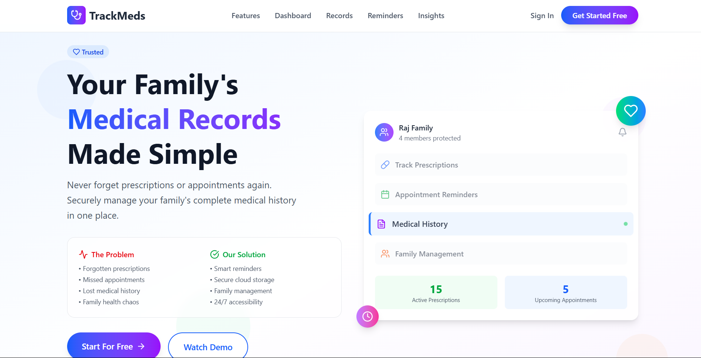
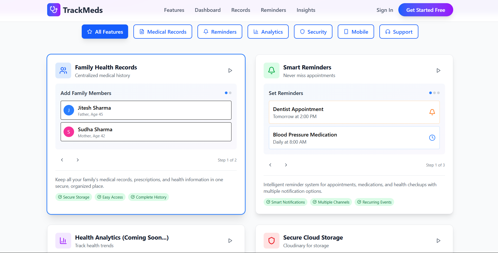
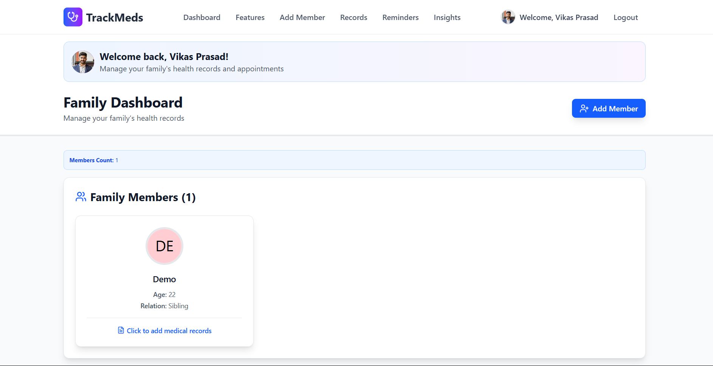
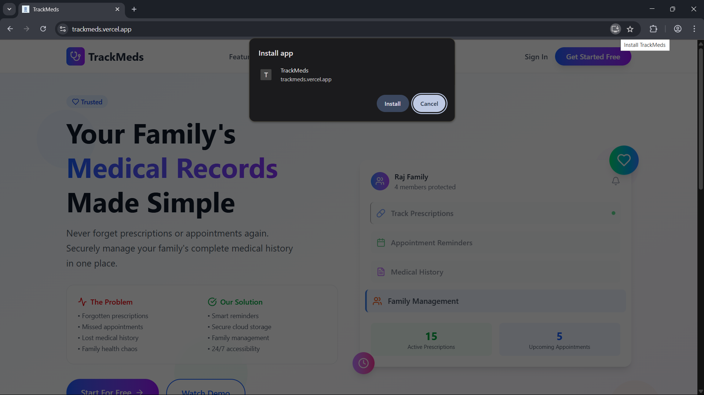
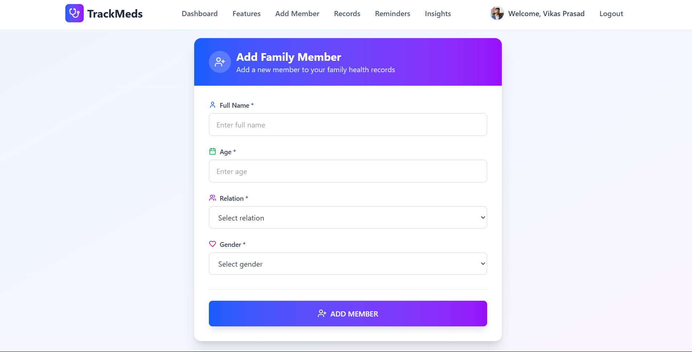
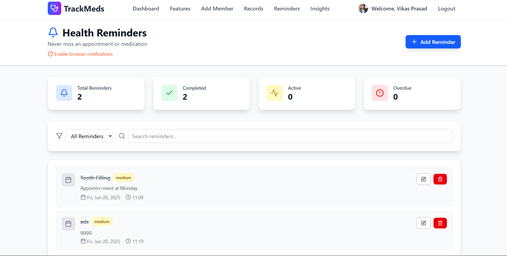

# 🩺 TrackMeds – Personal & Family Medical Record Manager

[]()
[]()

TrackMeds is a secure, responsive, and progressive web app (PWA) built using the **MERN Stack** that helps individuals and families **manage their medical records**, prescriptions, appointment reminders, and health reports—all in one place and search about the medicine using MedBot.

---

## 🚀 Features

- 🔐 **Authentication** – JWT-based sign up/sign in with profile picture upload
- 👨‍👩‍👧 **Family Member Management** – Add/edit/remove family profiles with relationship tags
- 📋 **Medical Records** – Add prescriptions, doctor visits, diagnosis, reports, and next appointment reminders
- ☁️ **Cloud Uploads** – Upload and access reports securely via Cloudinary
- 🔔 **Reminder System** – Schedule and view upcoming checkups or medication renewals
- 📱 **Progressive Web App** – Installable, offline-capable, and mobile-friendly
- 💡 **Interactive UI** – Built with Tailwind CSS & Framer Motion for smooth animations
- 🌐 **Responsive Design** – Works seamlessly across desktop, tablet, and mobile
- 🤖 **AI MedBot** - Get information about your medicine its usage, side-efects, etc.

---

## 🛠️ Tech Stack

| Frontend  | Backend      | Database | Cloud & Tools       |
|-----------|--------------|----------|---------------------|
| React.js  | Express.js   | MongoDB  | Cloudinary, Vite    |
| Tailwind CSS | Node.js  | Mongoose | JWT  |

---

## 📦 Installation & Setup

### ⚙️ Backend

```bash
cd server
npm install
# Add .env file with Mongo URI, JWT secret, and Cloudinary config
npm run dev
```
### Frontend
```bash
cd client
npm install
npm run dev
```
### 📂Folder Structure
```bash
TrackMeds/
├── client/            # Frontend React App
│   ├── components/
│   ├── pages/
│   └── App.jsx
├── server/            # Backend Node.js + Express
│   ├── controllers/
│   ├── models/
│   ├── routes/
│   └── utils/
|   |__middlewares/
└── README.md
```

---

## 📸 Screenshots

### 🏠 Home Page  


### 📚 Features 


### 🩺 Dashboard 


### 📶 PWA  


### ➕ Add Member


### ⏲️ Reminder


---
### 🌟 Future Enhancements
- Export records as PDF
- Overall Insights 

### 🙋‍♂️ Author
Made with ❤️ by Vikas Prasad


